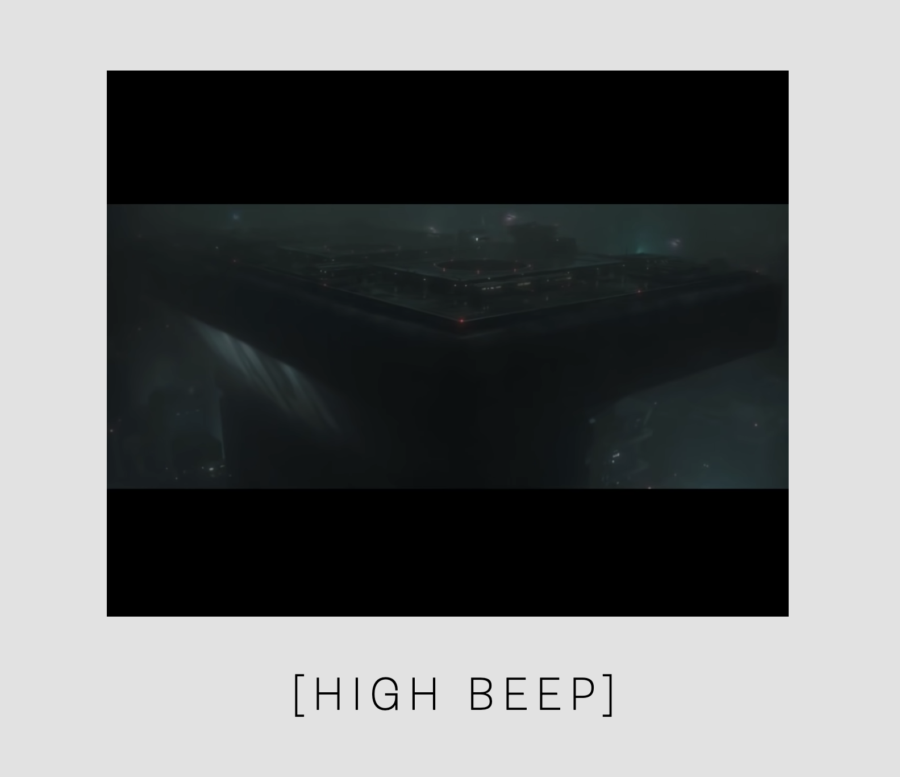
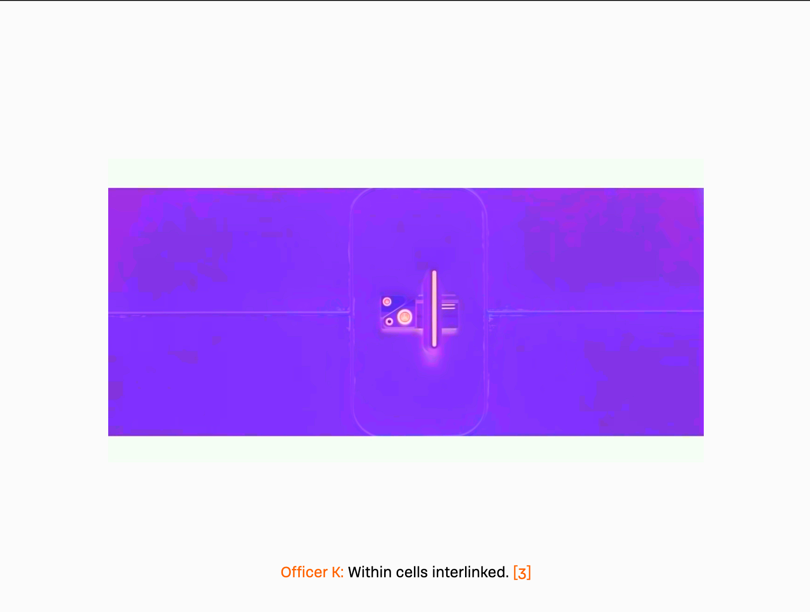
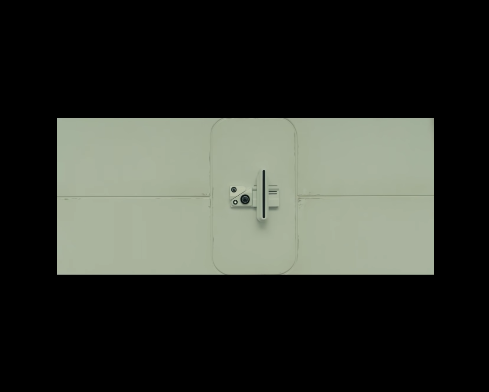
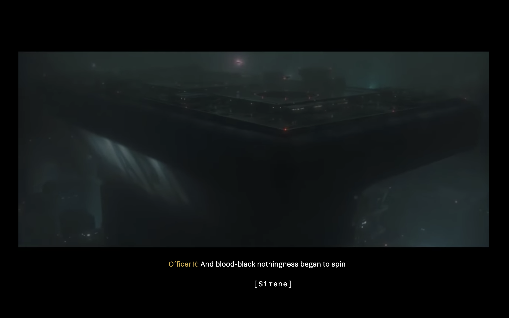
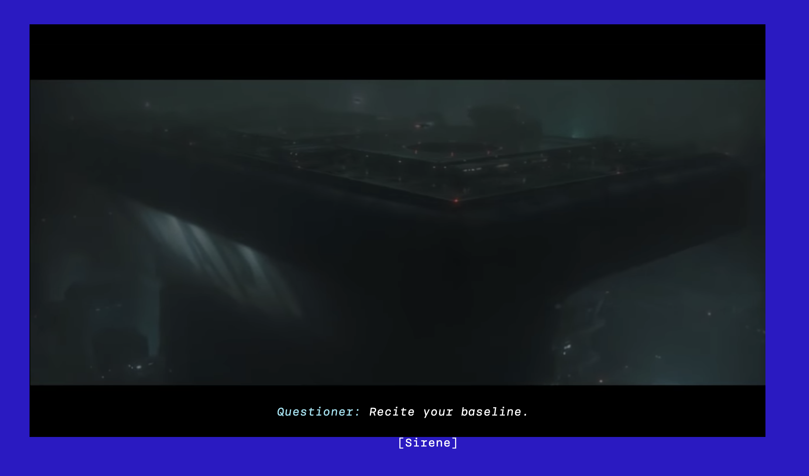
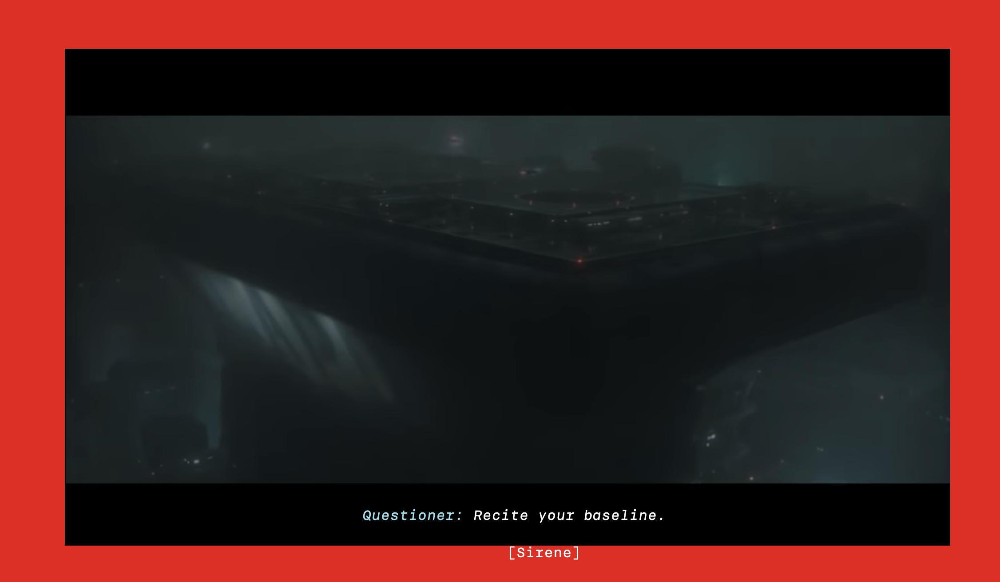

# Onderbouwing - Web-Typografie
---

## Inleiding
---
Voor het vak *Web-Typografie* mocht ik de closed-captions vormgeven voor Darice. Darice is rond haar zesentwintigste doof geworden, dus zij is niet opgegroeid met gebarentaal, waardoor het communiceren of begrijpen van dingen een stuk lastiger werd.
In deze readme zal ik het proces beschrijven van de closed-captions.
 

### Voorbereiding
---
Allereerst hadden we per groepjes van ongeveer vier personen een gesprekje met Darice. In dit gesprek hebben mijn groepje en ik vragen gesteld over wie Darice is en hoe het precies zit met het lezen van closed captions als iemand een hoorprobleem heeft. Hier kwamen de volgende punten uit:  
• Als er een achtergrond geluid is, ziet ze dit graag tussen [brackets].  
• Elk persoon die wat zegt, heeft zijn eigen kleur.  
• Ze associeert donkere kleuren met spannendheid.  
• Als Darice een film kijkt, gebeurt dat meestal 's avonds.  
• Ze houdt van een minimalistische stijl.  
Na dit nuttige gesprek ben ik de film Blade Runner gaan kijken, want ik snapte de context van het filmpje niet.

### Onderbouwing Fontkeuze
---
We konden kiezen tussen twee dingen, een systeemfont of Brenner. Bij een systeemfont moest ik meten wat voor font de computer/laptop van Darice gebruikt, maar daar is lastig achter te komen. Bij het font Brenner zijn er meerdere stijlen mogelijk, waardoor je bepaalde sferen of gevoelens goed kan vormgeven. Vandaar dat ik voor Brenner heb gekozen.
 

### Week 1
---
<i>In deze week heb ik vooral het een en ander uitgeprobeerd om even mijn geheugen op te frissen aangezien het coderen al een tijd geleden was.</i>

#### 'Fuck-off'
In de eerste week heb ik het een en ander geprobeerd om te kijken hoe het in eerste instantie allemaal werkt. Allereerst heb ik de body een donkere kleur gegeven, omdat Darice liever 's avonds een film kijkt. Een donker scherm is hierbij fijner voor haar ogen. 
Ook heb ik gekeken hoe ik 'fuck off skin job' zo kwaad of dreigend mogelijk kon maken.  
</img> 
 
Op de afbeelding is te zien dat het mij gelukt was om de zin rood te krijgen en heb ik gekeken welk brenner font het beste werkte. Ik kreeg hier als feedback dat het lettertype goed werkte, alleen lijkt het nu alsof de hele zin geschreeuwd wordt. Het font is dus goed, maar niet voor de hele zin.

#### Buzzer en bieep
In de eerste week heb ik ook gekeken hoe ik woorden kon invoegen tussen de captions die al bestonden. Dit was al vrij snel gelukt, waardoor ik al wat geluiden kon vormgeven. Zie de afbeelding hieronder.  
</img></img> 
 
Door in css met keyframes te werken heb ik voor elkaar gekregen het woord te laten 'shaken', want als er een toeter af gaat resoneren vaak objecten in de buurt. Vandaar dat ik op het idee kwam om het woord te laten trillen. Ook heb ik bij de buzzer een dikker font meegegeven, omdat dat een zwaarder geluid is dan de pieptoon. Die heeft een dunner font.  
Darice zei in het eerste gesprekje dat ze bewegende tekst afleidend vindt, dus ik heb de animatie zo klein mogelijk gehouden.
Toch kreeg ik de feedback om het nog meer vorm te geven. Bijvoorbeeld met kleur op de achtergrond, dus dat neem ik mee naar volgende week.

### Week 2
---
<i>Deze week heb ik een aantal dingen van week 1 verder uitgewerkt en heb ik nieuwe ideeën bedacht om meer een spanning mee te geven aan de film.</i>

#### 'Fuck-off'
Na de feedback te hebben gehad dat niet de hele zin geschreeuwd wordt, heb ik alleen de eerste twee woorden rood en wat groter gemaakt. Zie de afbeelding.  
</img>

#### Buzzer en bieep
Ik heb gekeken hoe ik bij de geluiden van de buzzer en de pieptoon meer een gevoel kon meegeven. Dit heb ik opgelost door de achtergrond een kleur mee te geven. Bij de buzzer is dit een rode achtergrond en bij de pieptoon een witte achtergrond. 
Bij rood associeer ik een harder geluid en bij wit een felle of hoge toon, dus vandaar dat ik deze kleuren heb gekozen. 
</img></img>
 

#### 'Out of the box'
Ik zag dat klasgenoten al veel dingen hadden uitgeprobeerd die al lekker out of the box waren, dus ik begon wat te bedenken voor de pieptoon aan het einde van scène 1.  
Bij het andere vak 'Web-Animatie' hoorde ik iets over CSS Filter langskomen, dus het leek mij leuk om daar eens mee te gaan spelen.
 
</img></img>
 

Op de afbeelding zie je links dat het beeld negatieve kleuren heeft en rechts normale kleuren heeft. Rechts is ook het beeld net nadat het piepgeluid is afgelopen en links is als de pieptoon op zijn hoogst is.
Darice vond het niet storend en leuk bedacht, vooral omdat bij de afbeelding rechts het gevoel is alsof het stil valt en dat was precies de bedoeling.
 
Ik wil graag in scène 2 meer 'out of the box' ideeën bedenken. Ook wil ik daar meer spanning meegeven, omdat het personage daar veel zenuwachtiger overkomt.

### Week 3
---
<i>In deze week heb ik vooral gekeken naar scène 2. Het schermformaat heb ik groter gemaakt, want dat was ik nog vergeten in week 2. Ook heb ik een beetje mijn code doorgelopen aangezien er nog een paar kleine foutjes in stonden.</i>

#### Geluiden
Ik heb door de hele video heen nog een aantal geluiden toegevoegd in captions. Ik had soms een geluid wel vormgegeven, maar geen geluid erbij gezet. Dit was voor Darice soms nog te vaag. Het principe 'ignore conventions' is hierdoor beter verwerkt. 
</img>
 

Ook heb ik bij de geluiden, zoals een sirene de achtergrondkleur verandert waardoor het lijkt op een politiesirene.  
</img></img>
 

#### 'Out of the box'
Ik heb in scène 2 een rondje toegevoegd die het spannende geluid ondersteund wat bij de scène hoort. Deze veranderd steeds van grootte. Als het geluid indringender wordt, wordt het rondje groter. Ook de kleuren veranderen hierbij, op het spannendste moment wordt het rondje rood.  
Bij het rondje heb ik ook een trilling toegevoegd. Wanneer de scène op zijn spannendste is, trilt het filmpje harder.  
Om mij heen zag ik veel mensen die svg's in hun filmpjes hadden gezet en super leuke ideeën hebben bedacht, maar ik wilde niet meer dan wat ik nu had in mijn film omdat dit niet bij mij past. Ook heb ik naar Darice's feedback geluisterd dat ze van minimalistisch houdt en dat wilde ik niet verstoren.
