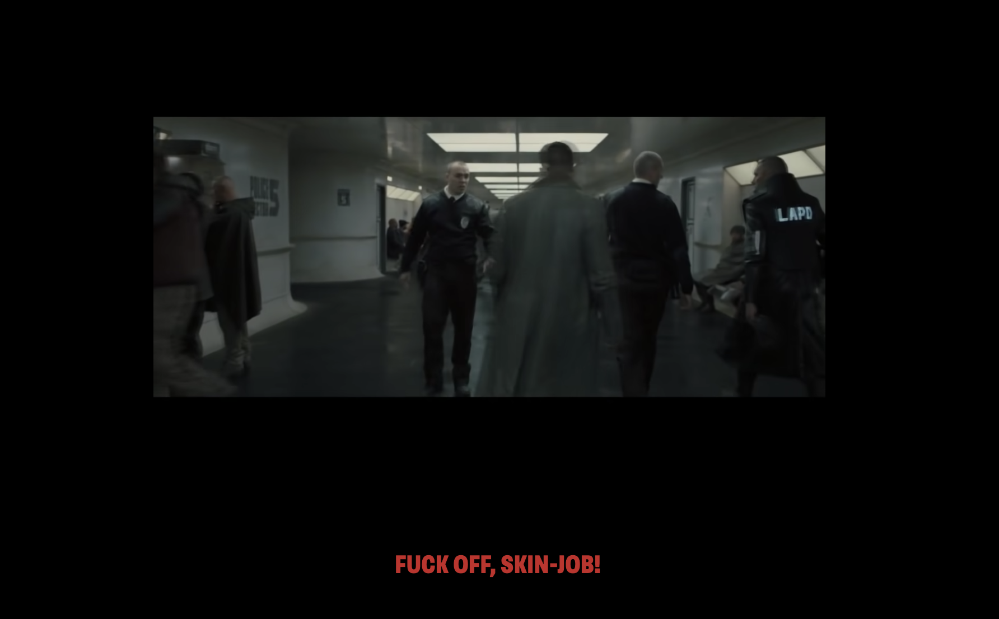
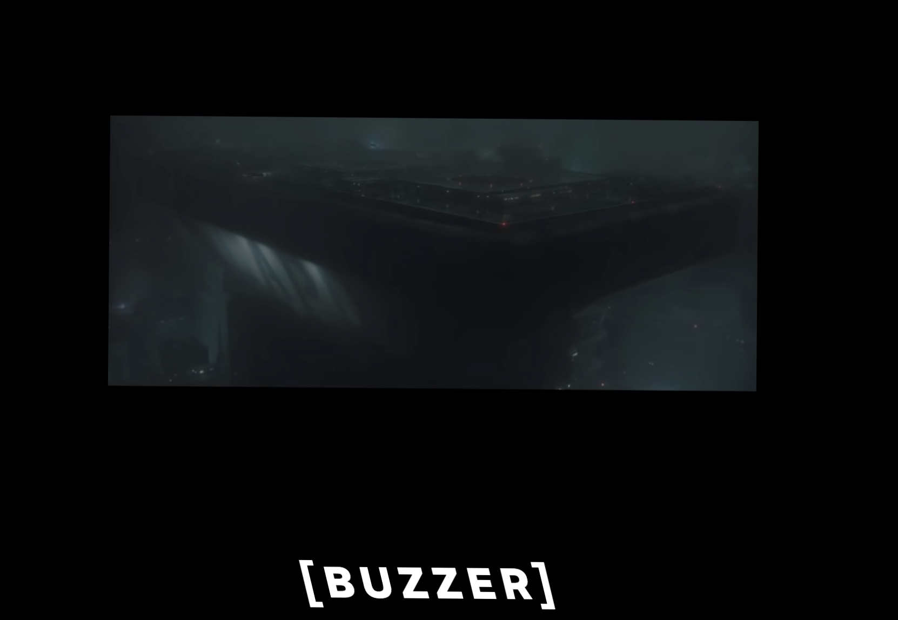
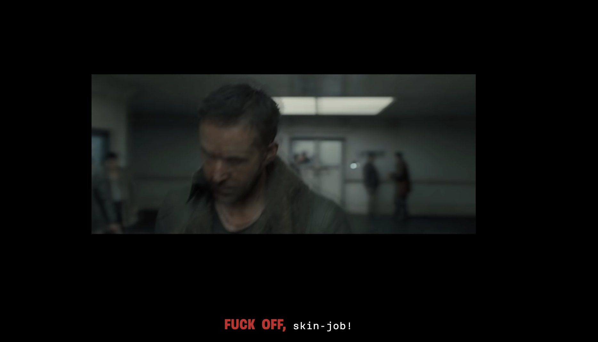
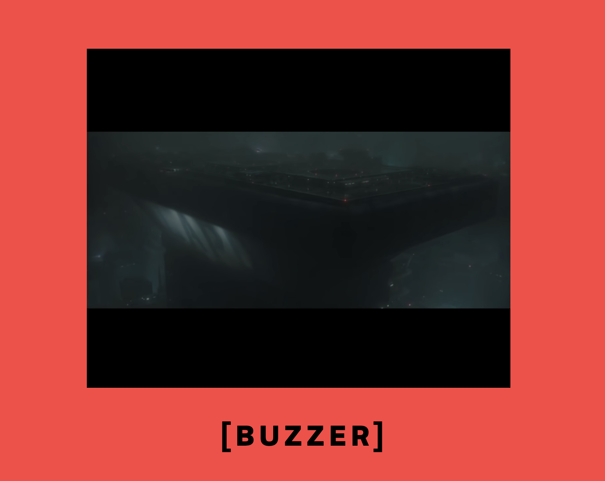

# Onderbouwing - Web-Typografie
---

## Inleiding
---
Voor het vak *Web-Typografie* mocht ik de closed captions vormgeven voor Darice. Darice is rond haar zesentwintigste doof geworden, dus zij is niet opgegroeid met gebarentaal, waardoor het communiceren of begrijpen van dingen een stuk lastiger werd.
In deze readme zal ik het proces beschrijven.
<br>

### Onderbouwing Fontkeuze
---
We konden kiezen tussen twee dingen, een systeemfont of Brenner. Bij een systeemfont moest ik meten wat voor font de computer/laptop van Darice gebruikt, maar daar is lastig achter te komen. Bij het font Brenner zijn er meerdere stijlen mogelijk, waardoor je bepaalde sferen of gevoelens goed kan vormgeven. Vandaar dat ik voor Brenner heb gekozen.
<br>

### Week 1
---
#### 'Fuck-off'
In de eerste week heb ik het een en ander geprobeerd om te kijken hoe het in eerste instantie allemaal werkt. 
Zo heb ik gekeken hoe ik 'fuck off skin job' zo kwaad of dreigend mogelijk kon maken. <br>
</img> <br>
Op de afbeelding is te zien dat het mij gelukt was om de zin rood te krijgen en heb ik gekeken welk brenner font het beste werkte. Ik kreeg hier als feedback dat niet de hele zin geschreeuwd werd, maar eigenlijk alleen het stukje 'fuck off'.

#### Buzzer en bieep
In de eerste week heb ik ook gekeken hoe ik woorden kon invoegen tussen de captions die al bestonden. Dit was al vrij snel gelukt, waardoor ik al wat geluiden kon vormgeven. Zie de afbeelding hieronder. <br>
</img>
Door in css met keyframes te werken heb ik voor elkaar gekregen het woord te laten 'shaken', want als er een toeter af gaat resoneren vaak objecten in de buurt. Vandaar dat ik op het idee kwam om het woord te laten trillen. Toch leek het een aantal mensen leuker om het nog meer vorm te geven. Bijvoorbeeld met kleur op de achtergrond, dus dat heb ik meegenomen naar de week erna.

<br>

### Week 2
---
#### 'Fuck-off'
Na de feedback te hebben gehad dat niet de hele zin geschreeuwd wordt, heb ik alleen de eerste twee woorden rood en wat groter gemaakt. Zie de afbeelding. <br>
</img>

#### Buzzer en bieep
Ik heb gekeken hoe ik bij de geluiden van de buzzer en de pieptoon meer een gevoel kon meegeven. Dit heb ik opgelost door de achtergrond een kleur mee te geven. Bij de buzzer is dit een rode achtergrond en bij de pieptoon een witte achtergrond. 
Bij rood associeer ik een harder geluid en bij wit een felle of hoge toon, dus vandaar dat ik deze kleuren heb gekozen.<br>
</img>

<br>

### Week 3
---


<br>


### Animatie
---
De link naar mijn animatie: https://dorinereijersen.github.io/web-animatie/

De interacties die het bevat zijn het volgende:<br>
 • Als de pagina geopend wordt, zijn er twee pijlen die bewegen. Dit heb ik gedaan, omdat in het echt de pijl op de weegschaal naar rechts beweegt, zodra er gewicht op de schaal komt. <br>
 Ik heb dit gedaan door bij de lange pijl deze code neer te zetten:
    
    ```css
    svg #pijl polygon:first-child {
    animation: pijl 1s ease-in-out infinite alternate;
    transform-origin: bottom;
    }
    svg #pijl polygon {
    animation: pijltje 1s ease-in-out infinite alternate;
    transform-origin: bottom;
    }
    ```
    
Voor de kleinere pijl heb ik deze code hieronder gebruikt. Hier zie je dat de origin vanaf links draait, omdat het anders de verkeerde richting op gaat.

    ```css
    svg #pijl_klein polygon:last-child {
    animation: pijl .5s ease-in-out infinite alternate;
    transform-origin: left;
    }
    svg #pijl_klein polygon {
    animation: pijltje .5s ease-in-out infinite alternate;
    transform-origin: left;
    }
    ```

• De punten van de pijlen worden oranje als je er overheen hovert. Op mobiel kan je hier op klikken. <br>
• Kleuren worden negatief als je op je toesenbord op Z drukt. De Z staat voor het type model van de weegschaal. 
Ik heb eerst gekeken met console.log wat voor getal de Z is, dat is dus 90. En vanaf daar gaat de code precies hetzelfde als wanneer je ergens op klikt, alleen verander je na EventListener de 'click' in 'keydown'.
    ```js
    var bodyBG = document.querySelector('body');

    window.addEventListener("keydown", toggle);

    function toggle(event) {
        if(event.keyCode === 90) {
            bodyBG.classList.toggle('click');
    }
 }
    ```
